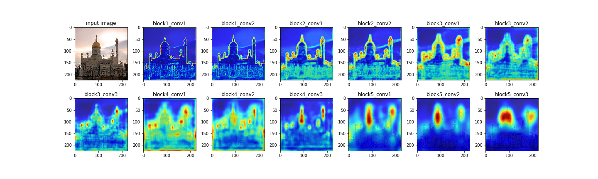

# visualization of vgg
visualizing  what each convolutional layers are learning of vgg architecture on mosque images which is class of imagenet

if you want to run the code just download the gradcam_plus_plus_visualization_on_each_layer_of_vgg.ipynb file 

# Requirements

Keras  2.3.1,
matplotlib 3.0.3,
numpy 1.16.2,
scipy  1.4.1,
tensorflow 2.1.0,

# Results

